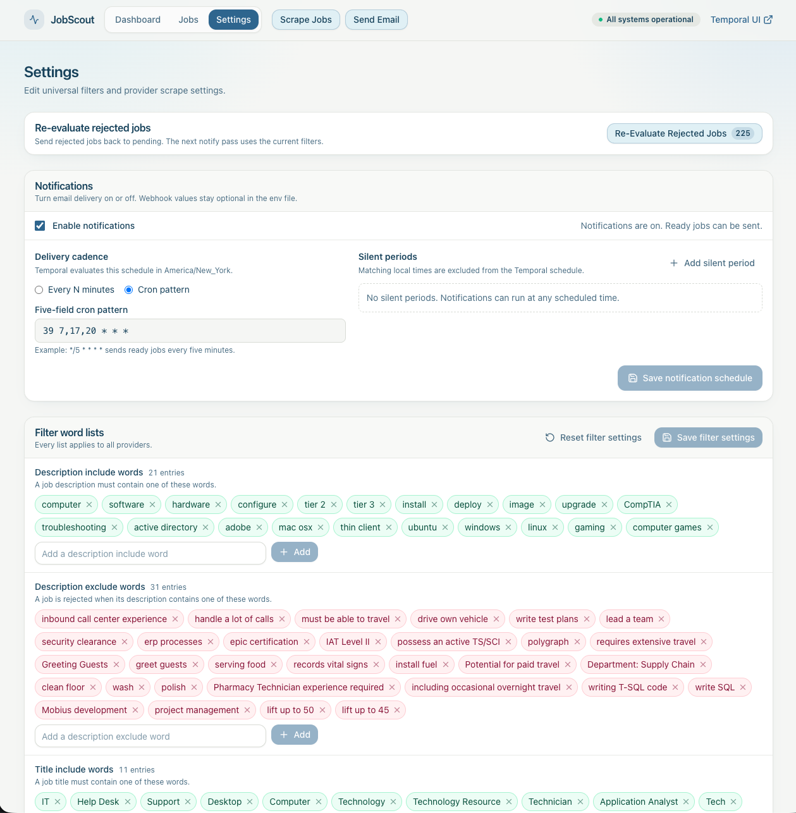
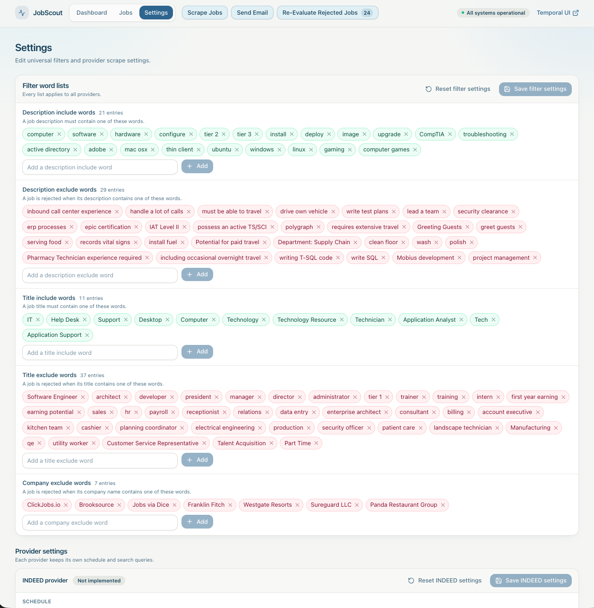
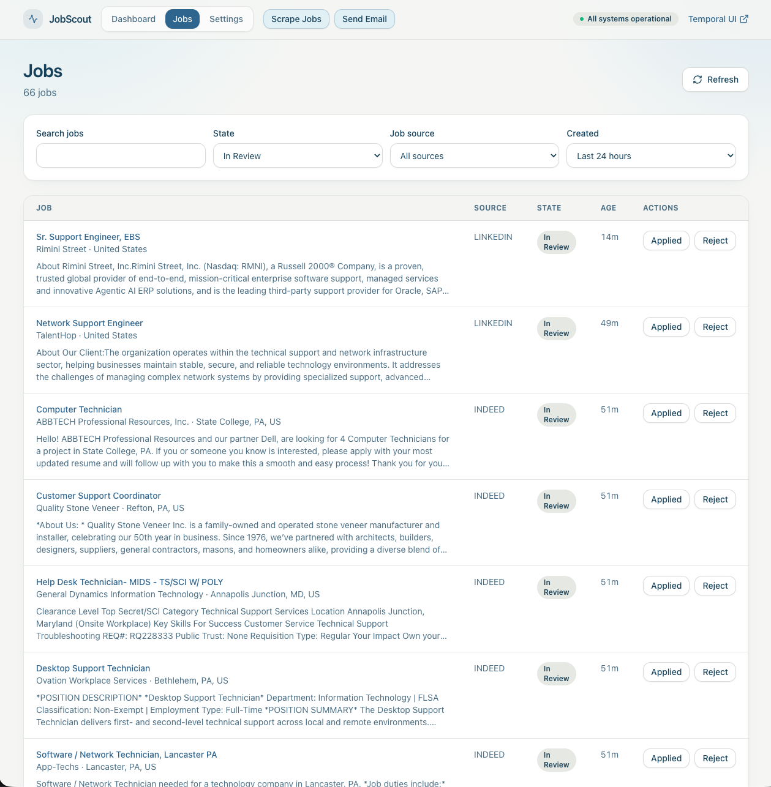

# Job Scout

Job Scout is yet another homegrown application for job seekers. It quietly searches for jobs on popular sites like LinkedIn, Dice, etc and then picks out the good ones.

The user gets a dashboard for monitoring, stats, and reviewing jobs

**Future Ideas**

- LLM resume generation, customized for each job
- LLM filtering step (not everything can be simple rules, though simple rules are *fast*)
- More providers!

**Start here:** [QUICKSTART.md](QUICKSTART.md) — clone the repo, set `.env`, and start the stack on Windows, macOS, or a Raspberry Pi.

---

## Screenshots







## Architecture

The system is designed to run durable tasks with Temporal as the orchestrator. This is to prepare for the future, when long-running tasks and retry policies will become more important.

WIP - need more details here                                                                                                             |

## Dependencies

Go was a purposeful language choice, because I'm vide-coding this project out of thin air. My reasoning was that Go provides the least flexibility, so this would be the best choice for (1) AI agents staying on the same page as the project grows (2) other humans collaborating with me.

The module uses a small set of libraries:

- `go.temporal.io/sdk` — Temporal SDK
- `github.com/jackc/pgx/v5` — Postgres driver (behind stdlib `database/sql`)
- `golang.org/x/net/html` — HTML parsing

All other code uses the standard library (`net/http`, `database/sql`, `encoding/json`, `log/slog`, `embed`).

## Project structure

```text
.
├── docs/screenshots/           # PNG captures for this README
├── data/                       # local Postgres data (gitignored)
├── config/                     # Temporal dynamic config
├── docker-compose.yml          # postgres, temporal, temporal-ui, api, worker
├── Makefile
├── QUICKSTART.md
└── job-scout/                  # Go module
    ├── go.mod
    ├── Dockerfile              # Node frontend stage, Go build stage, final image
    ├── webui/                  # Vite, React, and TypeScript operator UI
    ├── cmd/jobscout/main.go    # entrypoint: "api" | "worker"
    └── internal/
        ├── config/             # env-based config (single source of truth)
        ├── db/                 # connection, embedded migrations + seeds, queries
        ├── scraper/            # provider interface, LinkedIn (x/net/html), service
        ├── pipeline/           # temporal client, workflow, activities, worker
        └── api/                # ServeMux routes + handlers
```


## Tools for local work

You need Docker and Docker Compose to run the stack. You need Go 1.25+ only for local Go builds and tests. Node.js 20+ is optional. Use it only for `make ui-test` on the host. You need Make only if you use the `make` targets (macOS and Raspberry Pi). Windows can use `docker compose` as in [QUICKSTART.md](QUICKSTART.md).

`make up` starts Postgres, Temporal, the API, the worker, and a Vite UI container. You do not run `npm` on the host for that path. Open [http://localhost:5173](http://localhost:5173) for the live operator UI. The API also serves the embedded production bundle at [http://localhost:8001](http://localhost:8001).

To run frontend tests on the host:

```bash
make ui-test
```

Basically, all you need to know is `make up` and `make down` if you want to run this app. However there are other helpful make commands for the developers:

```bash
make up           # build and start the stack, including the Vite UI
make down         # stop the stack and the Vite UI
make restart      # restart containers
make build        # build images only
make logs         # follow logs
make clean        # down + prune volumes/images
make go-build     # compile the Go binary locally
make go-test      # run Go tests
make ui-test      # run frontend tests (installs npm deps if needed)
make fmt          # gofmt the module
make vet          # go vet the module
make connect-db   # psql into the postgres container
make run          # POST /api/v0/run
make notify       # POST /api/v0/notify
```

## Operator UI

Open [http://localhost:5173](http://localhost:5173) after `make up`. That is the live operator UI. [http://localhost:8001](http://localhost:8001) is the API and the embedded production bundle. The UI's main purpose is to manage the Settings for the scraping, as well as hold your the todo list of which jobs to review & apply to IRL.

## API endpoints

This section will eventually be removed, and instead the app should host OpenAPI docs somewhere, and point README to swagger or ReDoc. 

Base path: `http://localhost:8001/api/v0`

| Method   | Path                                         | Description                                                                                                 |
| -------- | -------------------------------------------- | ----------------------------------------------------------------------------------------------------------- |
| POST     | `/run`                                       | Start `ScrapeWorkflow`. `?force=1` bypasses provider cadence.                                               |
| POST     | `/notify`                                    | Start `NotifyWorkflow`.                                                                                     |
| POST     | `/scrape`                                    | Run a synchronous debug scrape without Temporal. Prefer `/run`.                                             |
| GET      | `/health`, `/db-test`, `/temporal-test`      | Read service and dependency health.                                                                         |
| GET      | `/status`                                    | Read aggregate database and Temporal status.                                                                |
| GET      | `/config`                                    | Read effective, redacted operator configuration.                                                            |
| GET      | `/dashboard/stats`                           | Read provider aggregates and daily job counts.                                                              |
| GET      | `/workflow/{id}`                             | Read workflow status and run ID.                                                                            |
| GET      | `/jobs`                                      | List jobs with filters, stable paging, and an `as_of` anchor.                                               |
| GET      | `/jobs/{id}`                                 | Read one job, including its description.                                                                    |
| POST     | `/jobs/{id}/review`                          | Mark a `ready` job as `applied` or `dismissed`.                                                             |
| GET      | `/jobs/stats`                                | Read job counts. `new_jobs` is the `pending` count.                                                         |
| POST     | `/jobs/re-evaluate`                          | Move rejected jobs to `pending`, reset detail attempts, and wake processing. Returns the updated row count. |
| GET, PUT | `/search-settings`                           | Read or replace universal search settings.                                                                  |
| POST     | `/search-settings/reset`                     | Reset universal search settings to seed values.                                                             |
| GET      | `/scraper-settings`, `/scraper-settings/all` | Read one provider or all providers.                                                                         |
| PUT      | `/scraper-settings/{job_source}`             | Replace one provider configuration.                                                                         |
| POST     | `/scraper-settings/{job_source}/reset`       | Reset one provider to seed values.                                                                          |

## Monitoring

The temporal UI is a place to watch all the job orchestration. What you'll notice is a couple of main points:
1. There is a scraper workflow on a schedule, and executes all the scrapers that are "ready"
2. There is a contantly searching `continue as new` filtering job, which is looking for new jobs that have been just scraped, but need filtered. Filtering means, it tries to reject things right away or mark them for further processing.
3. There is a constantly searching dispatcher as well, which is looking for jobs that made it through the filter but require add'l details. Usually this requires a more expensive API call. Or perhaps in the future an expensive LLM call. Therefore, items are purposely drip fed slowly over time by this dispatcher, in order to minimize and avoid stampdedes.

- Temporal UI: [http://localhost:8082](http://localhost:8082)

## Contributing

I would welcome some help! 

1. Fork the repository.
2. Create a feature branch.
3. Commit your changes.
4. Push the branch.
5. Create a pull request.

